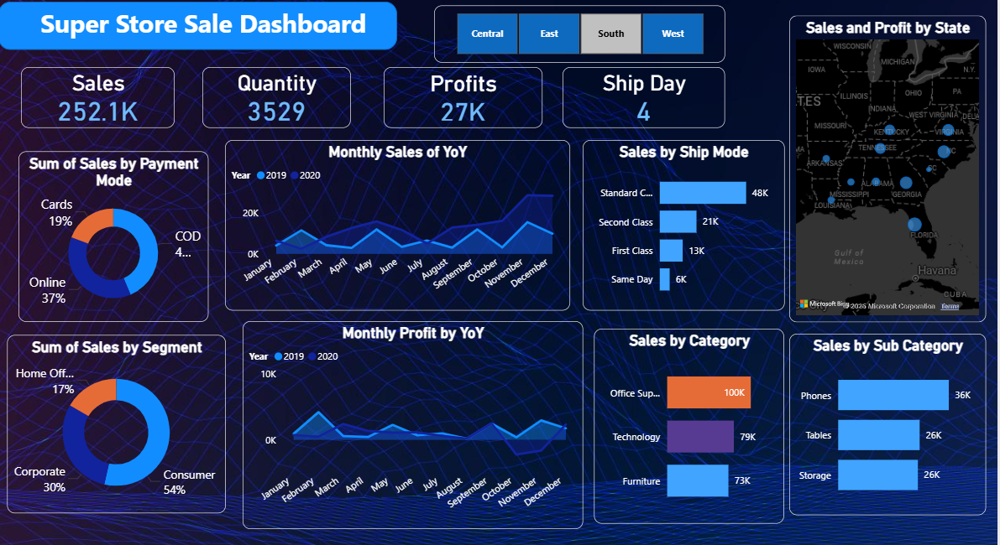
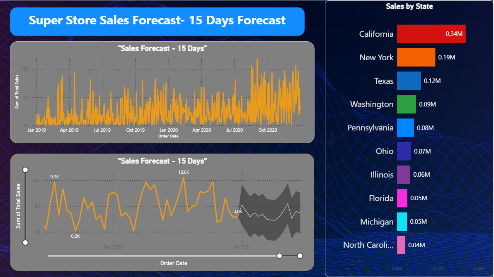

# 🛒 Super Store Sales Dashboard & Forecast

This project features a Power BI dashboard analyzing and forecasting US Super Store sales performance. The underlying dataset contains detailed transaction records, enabling rich visualizations and predictive analysis for actionable business insights.

---

## 🚀 Project Objectives

- Provide clear visual insights into sales, profits, segment distribution, and regional/state-level performance.
- Analyze trends across multiple business dimensions including shipping modes, product categories, time-series patterns, and payment behaviors.
- Forecast future sales for actionable planning using Power BI analytics.

---

## 📊 Data Source

- **File:** `SuperStore_Sales_Dataset.csv`
- **Content:** Each row represents a store transaction, with columns for order date, ship date, customer, segment, region, product details, sales, profit, return status, and payment mode.

---

## 🖼️ Dashboard Components

### 1. KPI Cards

- **Total Sales:** 252.1K
- **Total Quantity Sold:** 3,529
- **Total Profits:** 27K
- **Average Ship Day:** 4

### 2. Sales Analysis

- **Monthly Trends:** Line charts display YoY monthly sales and profits to highlight seasonality and growth.
- **Sales by State:** Map and bar chart show top states by total sales, spotlighting California (0.34M), New York (0.19M), Texas (0.12M), and others.
- **Sales by Segment:** Consumer (54%), Corporate (30%), and Home Office (17%).
- **Sales by Payment Mode:** Online (37%), Cards (19%), COD (4%).
- **Sales by Ship Mode:** Standard Class leads, followed by Second Class, First Class, and Same Day.

### 3. Category Performance

- **Sales by Product Category:** Office Supplies (100K), Technology (79K), Furniture (73K).
- **Top Sub-Categories:** Phones (36K), Tables (26K), Storage (26K).

### 4. Forecasting

- **15-Day Sales Forecast:** Time series charts forecast short-term sales, assisting inventory and allocation planning.

---

## 📂 File Structure

| Filename                     | Description                                 |
|------------------------------|---------------------------------------------|
| SuperStore_Sales_Dataset.csv | Main dataset for analysis                   |
| Dashboard.jpg                | KPI and Insights Dashboard       |
| Forecasting_Dashboard.jpg    | Sales Forecast Dashboard          |

---

_A snapshot of the Home page._

## 💡 Key Insights

- Consumer segment generates the largest share.
- California leads in total sales, with notable contributions from New York and Texas.
- Online payments are increasingly favored.
- Office Supplies is the largest product category.
- Power BI forecasting provides actionable 15-day future sales estimates.

_A snapshot of the insights page._

---

# ✔️ How to Use

1. Open the original Power BI `.pbix` file included in the repository.
2. Explore the pre-built dashboard with all visualizations and filters already configured.
3. Alternatively, open the `SuperStore_Sales_Dataset.csv` file in Power BI to create your own report from scratch.
4. Connect the dataset and apply visual designs as demonstrated in the included dashboard screenshots.
5. Explore detailed filters by region, ship mode, segment, and time for deep analysis.
6. Use the predictive charts for future-ready business strategies.

---

Including the original `.pbix` file allows you to learn from a ready-made dashboard or customize your own version based on the dataset.

---

## 👤 Author

**Sameer SHUKLA**

Project curated and analyzed by an aspiring Data Scientist, focusing on retail business analytics and visualization best practices.

----

## 📬 Connect with Us

- GitHub: [sam7041](https://github.com/sam7041)
- Email: sameershukla590@gmail.com
- LinkedIn: [sameershukla590](https://linkedin.com/in/sameershukla590)
- Instagram: [shuklasameer590](https://instagram.com/shuklasameer590)
- Twitter:[@sameershukla590](https://x.com/sameershukla590)

---
MIT License
Copyright (c) 2025 Sameer Shukla

---
