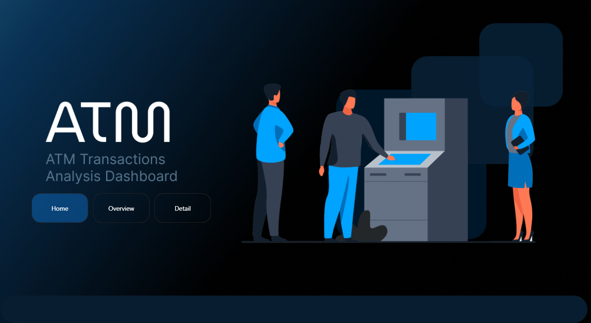
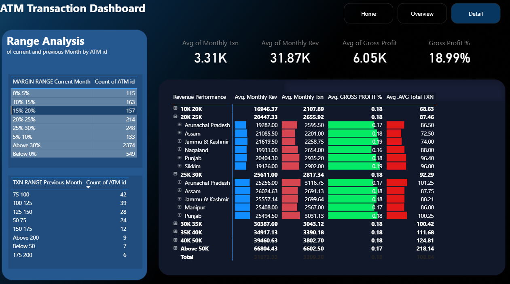

# 🚀 ATM Transactions Analysis

This repository contains an end-to-end data analysis project on ATM Transactions Analysis. The goal of this project was to analyze key business metrics and visualize the findings through an interactive Power BI dashboard.

_A snapshot of the Home page._

---
### 📊Project Overview
This Power BI dashboard provides an interactive and comprehensive analysis of ATM card transactions across various cities and states in India. It enables users to explore transaction behaviors, spending patterns, and ATM usage density by region. The dashboard utilizes multiple visual elements to offer meaningful insights about where ATM card transactions are most frequent, the volume of transactions by geography, and areas experiencing heavy load on ATM machines. These insights support better operational planning and resource allocation for banks and financial institutions.

---
## Visuals Description
The dashboard includes the following key visual elements:

* Line Charts: Track transaction trends over time, revealing monthly or seasonal variations in ATM usage.

* Bar Charts (Top Products/Regions): Highlight top-performing cities or states based on transaction volume and spending.

* Interactive Slicers: Allow dynamic filtering by location, time period, or other transaction attributes, empowering users to drill down into specific segments.

* KPI Cards: Present critical summary metrics such as total transactions, average spend per transaction, and ATM load intensity per location.

Together, these visuals facilitate quick identification of transaction trends, outliers, and regions with significant ATM load, enabling data-driven operational and strategic decisions.

_A snapshot of the main dashboard page._

---

### 📝 Key Findings

Based on the data analysis, here are the core insights derived from the project:

 * **Insight 1** : The North-Eastern states had relatively fewer ATMs but showed above-average transaction per ATM, highlighting strong utilization in under-served regions.

 * **Insight 2** : ATMs with higher financial transactions (>70% of total) generated significantly more revenue compared to ATMs with a higher share of non-financial transactions.

* **Insight 3** : Penalty costs and compensation payouts were major loss drivers for certain ATMs, directly reducing gross profit even when revenues were strong.

* **Insight 4** : ATMs falling into the “Below 0% Margin Range” category for consecutive months represent a persistent loss-making segment that needs strategic review (closure or relocation).

* **Insight 5** : Found that ATMs with revenue > ₹50K/month almost always achieved positive gross profit, whereas those below ₹25K struggled to cover fixed costs.

* **Insight 6** : At the bank level, even though the majority of ATMs are profitable, a small fraction of ATMs contribute disproportionately to overall profits — a classic Pareto effect (80/20 rule).

  
_A snapshot of the Detail page._

---

### 📂 Repository Structure

* `Atm_Data.xlsx`: The raw data source used for this analysis.
* `Atm_Txn_Project/`: This folder contains the Power BI project files (.pbip) which are optimized for version control.
* `assets/`: This folder holds all the images and screenshots used in this `README`.

---

### 🛠️ Tools & Technologies

* **Microsoft Power BI Desktop**: Used for data modeling, cleaning (Power Query), and dashboard creation.
* **Microsoft Excel**: The source of the raw, unstructured data.
* **DAX (Data Analysis Expressions)**: Employed to create custom measures and calculated columns.
* **Git & GitHub**: Used for version control and professional project hosting.

---

## Skills

- SQL
- Power BI
- Excel
- Data Analysis & Statistics
- DAX (Data Analysis Expressions)
- Python Programming
- Machine Learning
- Prompt Engineering

---

## 👤 Author

**Sameer SHUKLA**

Project curated and analyzed by an aspiring Data Scientist, focusing on retail business analytics and visualization best practices.

----

## 📬 Connect with Us

- GitHub: [sam7041](https://github.com/sam7041)
- Email: sameershukla590@gmail.com
- LinkedIn: [sameershukla590](https://linkedin.com/in/sameershukla590)
- Instagram: [shuklasameer590](https://instagram.com/shuklasameer590)
- Twitter:[@sameershukla590](https://x.com/sameershukla590)

---

## MIT License

Copyright (c) 2025 sam7041
